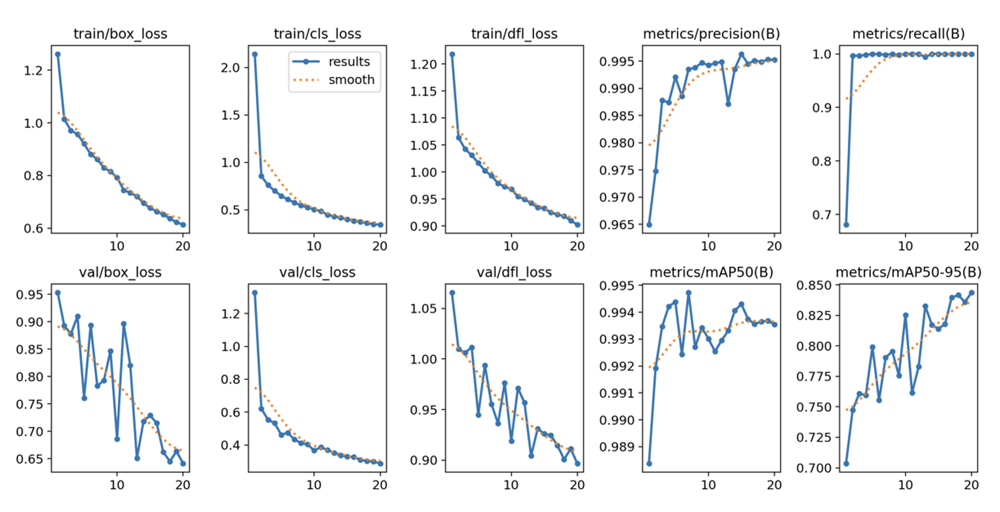

# Retail prices recognition

## Overview

Проект представляет собой ВКР на тему "Разработка системы компьютерного зрения по распознаванию информации на ценниках ритейл магазинов" по направлению 02.03.03 «Математическое обеспечение и администрирование информационных систем».

**Цель работы:** разработать программное средство для распознавания информации на ценниках продуктовых ритейл магазинов с использованием методов компьютерного зрения: object detection и OCR. 

Система должна находить следующие **целевые значения**: 
1. Название товара - description; 
2. Целая цена товара в рублях – price11; 
3. Добавочная цена товара в копейках – price12; 
4. Акционная целая цена товара в рублях (при наличии) – price21; 
5. Акционная добавочная цена товара в копейках (при наличии) – price22; 
6. Штрихкод товара (при наличии) – barcode; 
7. QR-код товара (при наличии) – QR; 
8. Номер товара на весах (при наличии) – ScaleNumber.

## Dataset

Для проведения экспериментов по обучению модели для детекции информации с акционных товаров было использовано **1817 изображений**. Каждое изображение было размечено (аннотировано) в соответствии с заранее заданными классами (8 значений). 

Для разметки использовалась open-source платформа для аннотации изображений CVAT.

Разметка проводилась следующим образом:
1.	 В платформе CVAT под каждое целевое значение была заведена сущность типа «bounding box» (объект прямоугольной области), которая позволяет размечать прямоугольные области на изображении путем проставления двух точек – левого верхнего и правого нижнего угла.
2.	 На каждом изображении были выделены все области, соответствующие целевым значениям.
3.	 По завершению разметка была выгружена в формате YOLO, где каждому изображению соответствует свой текстовый файл с координатами размеченных на этом изображении областей. Каждая строка файла содержит 5 числовых значений формата «class x y w h», разделенных пробелом, где
•	 «class» - целевая метка (значение от 0 до 7),
•	 «x» - координата по оси Ox левого верхнего угла bounding box’a,
•	 «y» - координата по оси Oy левого верхнего угла bounding box’a,
•	 «w» - ширина bounding box’a,
•	 «h» - высота bounding box’a.

Далее, используя разметку для моделей детекции, были нарезаны и сохранены в отдельный датасет изображений с ценами. Всего в наборе данных получилось 6245 изображений.

Каждое значение цены с изображений из набора данных для модели OCR было для удобства сохранено в названии изображения. Например, если на изображении изображена цена 149, то название изображение было изменено следующим образом - «149_имя_файла.jpg».

Как видно на графике ниже, не на всех изображениях представлены все классы. В частности, на изображениях практически не представлен класс «Scale number» («Номер товара на весах») – 11 примеров. При этом на всех изображениях точно присутствуют два класса – «Description» («Описание») и «Price11» («Цена товара в рублях») – по 1814 примеров. Также почти для каждой полной цены в рублях имеется указание в копейках.

Набор данных для обучения модели детекции был разделен на три части:
* train (обучающая выборка) – 1638 изображений,
* valid (валидационная выборка) – 111 изображений,
* test (тестовая выборка) – 112 изображений.

Преобразования данных (аугментации):
* поворот изображения (rotation),
* зеркальное отображение относительно вертикальной оси,
* случайная обрезка изображения (random crop),
* приближение изображения (zoom),
* блики и шумы (noise).

## Models

### YOLO experiments

Процесс распознавания необходимой информации на изображениях состоит из двух задач:
* детекция,
* распознавание цен (задача OCR).

В качестве моделей детекции были выбраны one-stage алгоритмы семейства YOLO. Были взяты актуальные и наиболее использующиеся версии данной модели:
* YOLOv5n,
* YOLOv5s, 
* YOLOv5m,
* YOLOv8n,
* YOLOv8s,
* YOLOv8m,
* YOLOv8l.

В общей степени было проведено 10 экспериментов по обучению данных моделей. Все метрики во время обучения и валидации моделей логировались в ClearML.
Дополнительная информация о параметрах обучения:
* размер изображения – 640x640,
* размер батча – 16,
* оптимизатор – AdamW.

Ниже представлены результаты экспериментов.

| Номер эксперимента | Модель  | Количество эпох | Precision  | Recall    | mAP 50   | mAP 50-95 | fitness  |
|--------------------|---------|-----------------|------------|-----------|----------|-----------|----------|
| 1                  | Yolov5n | 20              | 0.993909   | 1         | 0.995    | 0.827     | 0.8443   |
| 2                  | Yolov5n | 50              | 0.9950619  | 1         | 0.994746 | 0.8353947 | 0.8513298|
| 3                  | Yolov5s | 20              | 0.995516   | 1         | 0.992714 | 0.841162  | 0.8563177|
| 4                  | Yolov5m | 20              | 0.995434   | 1         | 0.99355  | 0.830775  | 0.847053 |
| 5                  | Yolov8n | 20              | 0.9937673  | 0.9997799 | 0.9946031| 0.8283604 | 0.844984 |
| 6                  | Yolov8n | 20              | 0.9952267  | 1         | 0.9935396| 0.8426094 | 0.8577024|
| 7                  | Yolov8n | 50              | 0.99472454 | 1         | 0.9933571| 0.8407594 | 0.8560192|
| 8                  | Yolov8s | 20              | 0.995516   | 1         | 0.9927   | 0.8459    | 0.8608   |
| 9                  | Yolov8m | 20              | 0.993662   | 0.9987605 | 0.9946475| 0.852544  | 0.8667544|
| 10                 | Yolov8l | 20              | 0.9952825  | 1         | 0.99446031| 0.843837 | 0.858899 |

| Номер эксперимента | Модель  | Количество параметров обучения | GFLOPs | Скорость инференса, мс |
|--------------------|---------|--------------------------------|--------|------------------------|
| 1                  | Yolov5n | 2510024                        | 7.184  | 2.218                  |
| 2                  | Yolov5n | 2510024                        | 7.184  | 3.085                  |
| 3                  | Yolov5s | 9125288                        | 24.058 | 4.548                  |
| 4                  | Yolov5m | 25069768                       | 64.374 | 10.055                 |
| 5                  | Yolov8n | 3012408                        | 8.202  | 2.389                  |
| 6                  | Yolov8n | 3012408                        | 8.202  | 2.488                  |
| 7                  | Yolov8n | 3012408                        | 8.202  | 2.669                  |
| 8                  | Yolov8s | 9125288                        | 28.662 | 5.162                  |
| 9                  | Yolov8m | 25860952                       | 79.088 | 11.438                 |
| 10                 | Yolov8l | 43636008                       | 165.433| 21.032                 |

По результатам экспериментов лучшим с точки зрения качества распознавания, а также условий и требований по производительности модели оказались эксперименты №6 и №7 – модели версии YOLOv8 nano. Данные модели имеют хорошее качество распознавания (более 85%) и быстрое время инференса (примерно 2,5 мс).

### OCR

Для обучения и тестирования были выбраны следующие модели:
* AOCR (Attention OCR),
* TrOCR (Transformer OCR): версии small и base,
* EasyOCR.

| Номер эксперимента | Модель       | Количество эпох обучения | Метрика CER | Метрика WER | Размер модели, Мб | Средняя скорость распознавания на тестовой выборке, с |
|--------------------|--------------|--------------------------|-------------|-------------|-------------------|--------------------------------------------------------|
| 1                  | AOCR         | 100                      | 0.070       | 0.143       | 31                | 0.019                                                  |
| 2                  | TrOCR-small  | -                        | 0.115       | 0.205       | 246               | 0.252                                                  |
| 3                  | TrOCR-base   | -                        | 0.105       | 0.188       | 1307              | 1.017                                                  |
| 4                  | EasyOCR      | 100                      | 0.213       | 0.308       | 94                | 0.368                                                  |

Mодель Attention OCR значительно превосходит остальные по скорости инференса, а также имеет наименьший размер (31 Мб). Несмотря на то, что модель TrOCR-base занимает вторую позицию по качеству распознавания, она оказалась самой большой по размеру и самой медленной по скорости распознавания (в среднем чуть более 1 секунды). Модель EasyOCR несмотря на небольшой размер отрабатывает медленнее, чем модели AOCR и TrOCR-small.

## Web API

Для реализации веб-сервиса был использован фреймворк `Gradio` ([ссылка на репозиторий](https://github.com/gradio-app/gradio)), который позволяет реализовывать веб-приложения для демо-решений и production систем.

Веб-сервис, база данных и инструменты мониторинга Grafana и Prometheus были развернуты вместе, используя технологию docker-compose. Docker-compose – это инструмент, который позволяет определять и запускать многоконтейнерные Docker-приложения с помощью файла конфигурации в формате YAML. Он упрощает управление множеством контейнеров, их зависимостями и настройками, позволяя запускать их одной командой.

Для запуска достаточно выполнить команду `docker-compose up --build` в корне проекта.

В левой части можно загрузить изображение для инференса.

При запуске сервиса на стартовой странице появляется несколько компонентов интерфейса:
•	 окно для загрузки изображений (левая часть),
•	 кнопка «Clear» очистки окна с входными данными,
•	 кнопка «Submit» для отправки данных на распознавание,
•	 окно для вывода изображения с распознанными и отрисованными целевыми значениями (правая часть),
•	 таблица с найденными ценами на изображениях (два столбца – «Исходная цена» и «Акционная цена (при наличии)»,
•	 таблица с найденными целевыми значениями (семь столбцов – «Название изображения», «Название класса», «Вероятность предсказания», «x_left», «y_top», «x_right», «y_bottom»), где последние четыре значения представляют собой координаты найденных целевых значений.

## MLOps

Основной MLOps инструмент – ClearML.

Используется для:
* версионирования наборов данных,
* мониторинга метрик в процессе обучения и тестирования,
* сохранения и версионирования артефактов обучения.

## ToDo

- [ ] Рефакторинг кода
- [ ] Обработка батча (нескольких) изображений веб-сервисом
- [ ]Повышение метрик распознавания засчет добавления данных из открытых источников (kaggle, roboflow)
- [ ] Классификация (кластеризация) названий товаров (например, с помощью metric-learning подхода)
- [ ] Настройка дашбордов в Grafana

